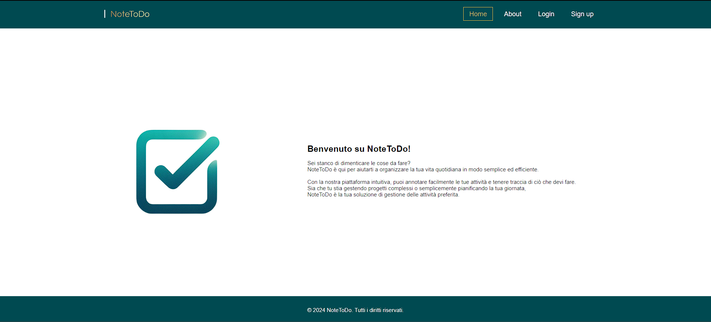
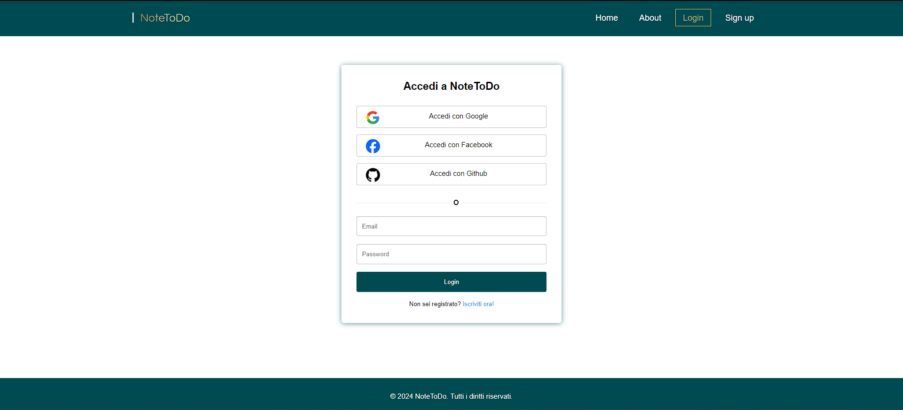

# NoteToDo 
> Home



> Login




## Per cominciare

Clona questa repository usando il seguente comando:

git clone: https://github.com/annamaria05/Oauth2_social_login.git

## Configurazione ed esecuzione Frontend (react-frontend)
Naviga fino alla directory:

	
	cd react-frontend
	 

 
Per la configurazione e l'esecuzione del frontend lancia i comandi:   


	npm install
 	npm start
 	

## Configurazione Backend (spring-social)

+ **Creazione database MySQL**


  Apri il terminale di MYSQL ed inserisci il seguente comando
	```bash
	mysql> create database spring_social
	```
 + **Configurazione username e password del database**

   
   All'interno del file ```application.yml``` inserisci le tue credenziali di accesso al db:
   
   	```yml
    # spring-social/src/main/resources/application.yml
    spring:
 	 datasource:
	    # Configurazione delle proprietà del datasource per il database MySQL
	    url: jdbc:mysql://localhost:3306/spring_social?useSSL=false
	    username: <tuo_username>
	    password: <tua_password>
   	 ```
+ **Specifica del Client Id e del Client Secret dei provider Oauth2**
  
      
	Prima di poter inserire il Client Id e il Client Secret dei provider, è necessario registrare un'app.
	Per fare ciò:
	+ Google:
   	  https://console.developers.google.com/
   
	+ Facebook:
          https://developers.facebook.com/
   
	+ Github:
 	  https://github.com/settings/developers

   	
 	```yml
  	# spring-social/src/main/resources/application.yml
	security:
	    oauth2:
	      client:
	        registration:
	          google:
	            # Configurazione delle credenziali OAuth2 per l'autenticazione tramite Google
	            clientId: <client_id>
	            clientSecret: <client_secret>
	            redirectUri: "{baseUrl}/oauth2/callback/{registrationId}"
	            scope:
	              - email
	              - profile
	          facebook:
	            # Configurazione delle credenziali OAuth2 per l'autenticazione tramite Facebook
	            clientId: <client_id>
	            clientSecret: <client_secret>
	            redirectUri: "{baseUrl}/oauth2/callback/{registrationId}"
	            scope:
	              - email
	              - public_profile
	          github:
	            # Configurazione delle credenziali OAuth2 per l'autenticazione tramite GitHub
	            clientId: <client_id>
	            clientSecret: <client_secret>
	            redirectUri: "{baseUrl}/oauth2/callback/{registrationId}"
	            scope:
	              - user:email
	              - read:user
	        provider:
	          facebook:
	            # Configurazione delle URL per l'autenticazione tramite Facebook
	            authorizationUri: https://www.facebook.com/v3.0/dialog/oauth
	            tokenUri: https://graph.facebook.com/v3.0/oauth/access_token
	            userInfoUri: https://graph.facebook.com/v18.0/me?						              fields=id,first_name,middle_name,last_name,name,email,verified&transport=cors

  		app:
		  auth:
		    tokenSecret: <token>
		    tokenExpirationMsec: 864000000

 	```
  Per la generazione del token, puoi far utilizzo del seguente sito: https://randomkeygen.com/.

  
  Una volta registrate le applicazioni, assicurati di aver aggiunto "http://localhost:8080/oauth2/callback/<nome_provider>" come URI di reinidirizzamento autorizzato nel provider. 

  Inoltre, assicurati di aver aggiunto i vari scope nel provider. 

+ **Esecuzione Backend**

  
   Se hai eseguito correttamente tutti i passi precedenti, ora naviga fino alla directory: 

	```
	cd spring-social 
	```
   Infine, per l'esecuzione del backend non ti resta che lanciare il comando:
 	```
	mvn spring-boot:run
	```

## Riferimenti 
  +  https://spring.io/guides/tutorials/spring-boot-oauth2/
  +  https://www.callicoder.com/spring-boot-security-oauth2-social-login-part-1/
