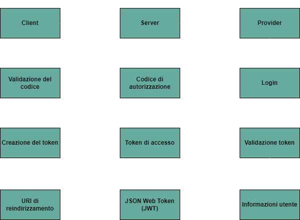

# NoteToDo 

Sei troppo impegnato e non vuoi dimenticare i tuoi impegni?  
Cerchi un modo per portare sempre con te la lista delle cose da fare? 

*NoteToDo* è l'applicativo che fa per te! 

Esso è stato realizzato puramente a scopo didattico: questo progetto è una dimostrazione del login tramite social con OAuth2 usando Spring Boot.


## Cos'è OAuth2

OAuth2 è un framework di autorizzazione che consente alle applicazioni di ottenere un accesso limitato agli account utente su un servizio HTTP.
Esso consente agli utenti di concedere a un'applicazione l'accesso a servizi di terze parti (come Google, Facebook, ecc.) senza dover condividere le proprie credenziali di accesso con l'applicazione. 

Invece di utilizzare le credenziali dirette dell'utente, OAuth2 utilizza "token" per ottenere l'accesso alle risorse. Esistono due tipi principali di token:

 + **Token di Accesso**: utilizzati per accedere alle risorse protette e hanno una durata 				 limitata.
 + **Token di Refresh**: utilizzati per ottenere un nuovo token di accesso una volta che il 
   			 precedente è scaduto.

OAuth2 introduce il concetto di "scope" (ambiti) per limitare l'accesso a particolari set di dati. Quando un'applicazione richiede l'accesso, può specificare esattamente a quali informazioni è interessata.

OAuth2 è progettato per essere sicuro quando correttamente implementato. Tuttavia, come per qualsiasi sistema di sicurezza, può essere soggetto a vulnerabilità se non configurato o mantenuto correttamente.

## Flusso di autenticazione OAuth2

Di seguito viene riportata un'immagine che illustra quello che è il flusso di autenticazione OAuth2 di NoteToDo.

> Flusso OAuth2



L'utente sceglie di effettuare il login: il processo inizia quindi dalla parte client dell'applicazione.  
Il server reindirizza, poi, l'utente all'URL di autorizzazione del provider scelto (*Google*, *Facebook*, *Github*). 

In questo punto, l'utente può decidere se concedere o meno l'autorizzazione alla pagina del provider. Se l'utente concede l'autorizzazione, il provider invia un codice di autorizzazione, che dovrà poi essere validato, al callback URL.
Se il codice è valido, allora il server scambierà questo con un token di accesso. 

Dopodichè si richiedono i dettagli dell'utente autenticato e segue l'aggiunta dell'utente sul database o il suo aggiornamento. 
Infine viene creato un JWT per l'utente ed esso viene reindirizzato all'URI fornito, con il JWT incluso come parametro della query string. 

> Home


> Login


## Dipendenze

L'applicativo è realizzato con Spring Boot, MySQL e React.
Assicurati di avere inserito le versioni qui indicate per il corretto funzionamento:

 + *Spring boot 2.5.15*
 + *Java 11*


## Per cominciare

Clona questa repository usando il seguente comando:

```git clone: https://github.com/annamaria05/Oauth2_social_login.git```

## Configurazione ed esecuzione Frontend (react-frontend)
Naviga fino alla directory:

	
	cd react-frontend
	 

 
Per la configurazione e l'esecuzione del frontend lancia i comandi:   


	npm install
 	npm start
 	
Ti si aprirà una pagina web che riporta all'indirizzo: ```http://localhost:3000```

## Configurazione Backend (spring-social)

+ **Creazione database MySQL**


  Apri il terminale di MYSQL ed inserisci il seguente comando
	```bash
	mysql> create database spring_social
	```
 + **Configurazione username e password del database**

   
   All'interno del file ```application.yml``` inserisci le tue credenziali di accesso al db:
   
   	```yml
    # spring-social/src/main/resources/application.yml
    spring:
 	 datasource:
	    # Configurazione delle proprietà del datasource per il database MySQL
	    url: jdbc:mysql://localhost:3306/spring_social?useSSL=false
	    username: <tuo_username>
	    password: <tua_password>
   	 ```
+ **Specifica del Client Id e del Client Secret dei provider Oauth2**
  
      
	Prima di poter inserire il Client Id e il Client Secret dei provider, è necessario registrare un'app.
	Per fare ciò:
	+ Google:
   	  https://console.developers.google.com/
   
	+ Facebook:
          https://developers.facebook.com/
   
	+ Github:
 	  https://github.com/settings/developers

   	
 	```yml
  	# spring-social/src/main/resources/application.yml
	security:
	    oauth2:
	      client:
	        registration:
	          google:
	            # Configurazione delle credenziali OAuth2 per l'autenticazione tramite Google
	            clientId: <client_id>
	            clientSecret: <client_secret>
	            redirectUri: "{baseUrl}/oauth2/callback/{registrationId}"
	            scope:
	              - email
	              - profile
	          facebook:
	            # Configurazione delle credenziali OAuth2 per l'autenticazione tramite Facebook
	            clientId: <client_id>
	            clientSecret: <client_secret>
	            redirectUri: "{baseUrl}/oauth2/callback/{registrationId}"
	            scope:
	              - email
	              - public_profile
	          github:
	            # Configurazione delle credenziali OAuth2 per l'autenticazione tramite GitHub
	            clientId: <client_id>
	            clientSecret: <client_secret>
	            redirectUri: "{baseUrl}/oauth2/callback/{registrationId}"
	            scope:
	              - user:email
	              - read:user
	        provider:
	          facebook:
	            # Configurazione delle URL per l'autenticazione tramite Facebook
	            authorizationUri: https://www.facebook.com/v3.0/dialog/oauth
	            tokenUri: https://graph.facebook.com/v3.0/oauth/access_token
	            userInfoUri: https://graph.facebook.com/v18.0/me?						              fields=id,first_name,middle_name,last_name,name,email,verified&transport=cors

  		app:
		  auth:
		    tokenSecret: <token>
		    tokenExpirationMsec: 864000000

 	```


  
  Una volta registrate le applicazioni, assicurati di aver aggiunto "http://localhost:8080/oauth2/callback/<nome_provider>" come URI di reinidirizzamento autorizzato nel provider. 

  Inoltre, assicurati di aver aggiunto i vari scope nel provider. 

+ **Esecuzione Backend**

  
   Se hai eseguito correttamente tutti i passi precedenti, ora naviga fino alla directory: 

	```
	cd spring-social 
	```
   Infine, per l'esecuzione del backend non ti resta che lanciare il comando:
 	```
	mvn spring-boot:run
	```

## Riferimenti 
  +  https://spring.io/guides/tutorials/spring-boot-oauth2/
  +  https://www.callicoder.com/spring-boot-security-oauth2-social-login-part-1/
